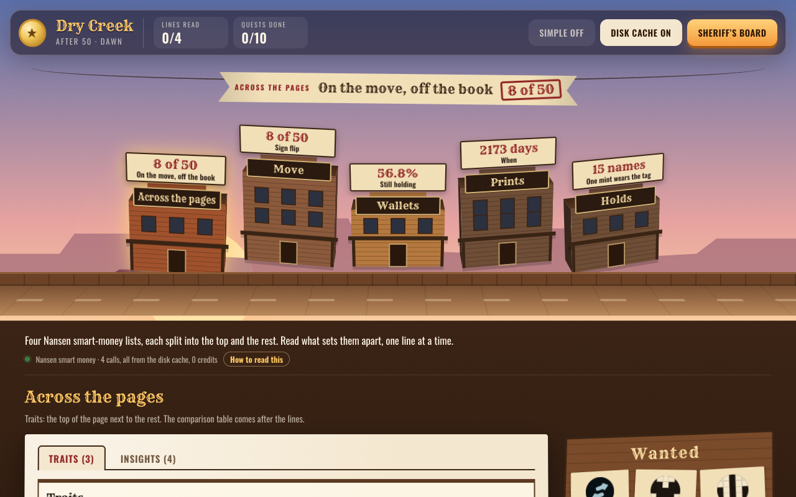
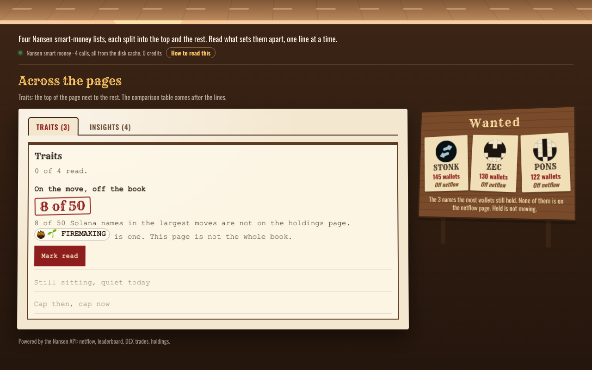
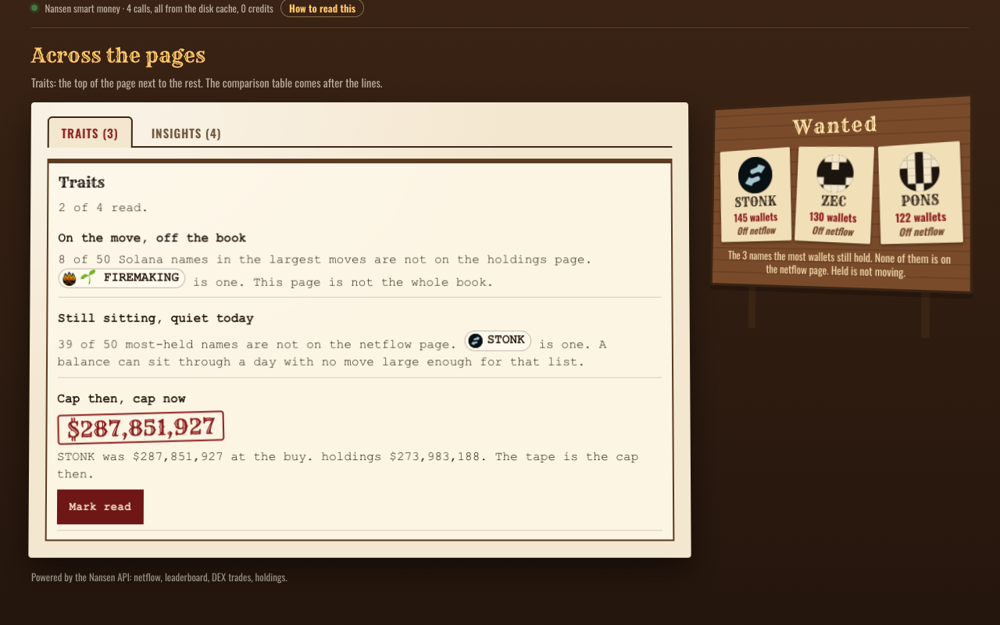
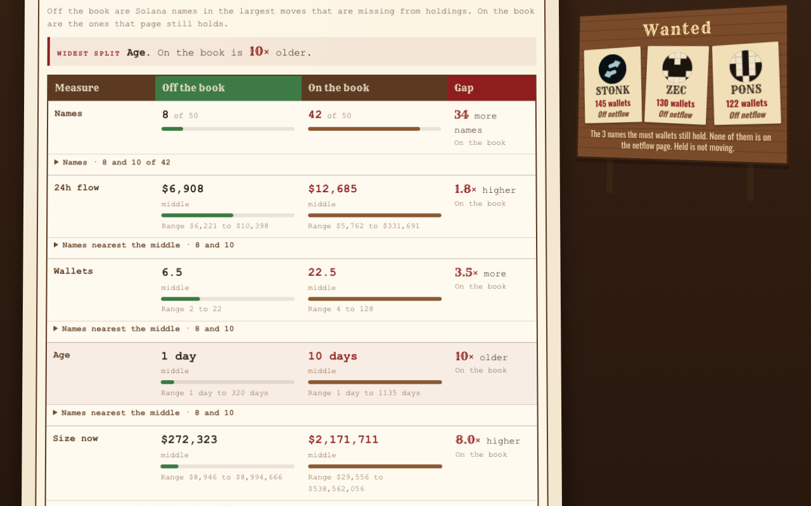

# After 50

Four smart-money lists. Each list is split into two groups.

Traits set the top of a list next to the rest of that same page. Insights set two deeper groups next to each other. Each quest opens on a line and the number that decided it, stamped in red. The comparison table is the last mark. A figure the payload does not contain is not shown. None of these seats is an order.

## Sites

Two public copies of this app.

- [https://after-50.onrender.com](https://after-50.onrender.com/) runs the Next server. Simple and Disk cache are in the top bar. The four posts go to the API. The free instance sleeps, then takes about a minute to wake.
- [https://after-50.surge.sh](https://after-50.surge.sh/) is the static copy. It reads the saved pages. Simple is in the top bar. Disk cache is not, because there is no server.

## Screenshots









## Video

<video src="./recording/room-and-board.mp4" poster="./recording/wanted.png" controls width="576" height="360"></video>

## Run it

You need Node 22 and npm. From this folder:

```bash
npm install
```

Create `.env.local` here with one line, `NANSEN_API_KEY=`, and your own key. `.env*` is gitignored.

```bash
npm run dev -- --port 43127 --hostname 127.0.0.1
```

Open [http://127.0.0.1:43127](http://127.0.0.1:43127). The first load posts four calls, 20 credits. With Disk cache on, a reload reads `data/nansen` and costs nothing.

`npm test` checks the rules and does not call Nansen.

## The town

The app is one screen, a town called Dry Creek. It calls the four routes once and builds the walk from them.

- The first line and its number hang on a banner strung across the street. Click it to open that line in the tray.
- The tray opens with a one-line pitch, a strip that counts the calls and credits, and **How to read this**, which explains Traits, Insights, off the book, the red stamp, and token names.
- Each page is a building with its first number on a placard. Click one to walk it in the tray below. Finishing a quest lights its windows, and the sky runs from dawn to night as the open quest is read.
- The street is in 3D. Each building is a box with sides and a roof. It turns by where it stands on screen, so the row reads as a curve and swings like a carousel when the street is swiped on a phone. The town tilts a little with the mouse; on a touch screen the camera drifts on its own. A coin turns in the top bar. All of it stays still when the system asks for reduced motion.
- The wanted board is pinned beside the open page, under it on a narrow screen: the three names the most wallets hold, each with its holder count next to its 24h netflow, or "Off netflow" when it is not on the netflow page.
- **Sheriff's board** opens a drawer that checks up to five names. `/board` opens the town with that drawer already open.
- Token names are chips. Click one for its address and links to Nansen and an explorer.

## Room

The room is one walk. It posts four routes when it opens: netflow, the profit leaderboard, dex trades, and holdings. Each costs 5 credits. A body already cached costs nothing.

The pages are walked in this order: Across the pages, Move, Wallets, Prints, Holds. Across the pages opens on On the move, off the book, then Still sitting, quiet today, then Cap then, cap now, then its table.

Each page has two quests. Pick Traits or Insights. Mark read moves to the next line. Simple, in the top bar, switches every line between the field sentence and a short reading. It does not reload. Disk cache, also in the top bar, keeps the disk cache on or off and reloads.

### Traits

- **Move.** The largest 24h moves against the quieter names on the same netflow page. The rank is the size of the move.
- **Wallets.** The 50 Solana wallets with the most 30-day profit against the other wallets on that list. Profit is only the cut.
- **Prints.** Buys on the Solana tape. Age and size are at the buy, for the profit-list wallets against the other wallets that printed.
- **Holds.** The names the most wallets still hold, on every chain in the call, against the thinner names on that page. Holder count only orders the list.
- **Across.** A name that shows up on one page and is missing from another. Its table sets the Solana names in the largest moves that are off the holdings page next to the ones still on it: count, 24h flow, wallets, age, size.

Each comparison table opens on its widest split. Every row shows both sides' middle value (or count), a bar, the low-to-high range, and how many names had a number. The Gap column says which side leads and by how much: a multiple when both sides are positive, points for shares, names for counts. Under each row, the names nearest each side's middle are folded away, each with its own value.

A zero, or a missing window, is not a sign flip. A null median is absent. Page 2 is not fetched. If the page is not the last page, the rest of the book is not here.

### Insights

Each insight table uses the same two columns as traits. The groups are different.

- **Move.** A coin 3 days old or younger whose 24h, 7d, and 30d flow match, next to a large coin with a green day and a 30d outflow more than five times that size.
- **Holds.** A thin seat that is not on the busiest chain. The same ticker on two chains. An address that appears on more than one chain. Three names that are most of the page.
- **On the move, off the book.** At least 9 flow traders and at most 8 holders on the same chain and address, next to a name with positive 24h flow and a holdings balance down at least 15%.

The same ticker on two chains is two coins. An address is only the same asset when the chain matches. The flow page is sorted by positive 24h, so it cannot show who left.

## The four calls

| Page | Route | Nansen | Body |
| --- | --- | --- | --- |
| Move | `POST /api/netflow` | `POST /api/v1/smart-money/netflow` | all chains, page 1, 100 rows, 24h descending |
| Wallets | `POST /api/leaderboard` | `POST /api/v1/smart-money/pnl-leaderboard` | Solana, 30 days, page 1, 1000 rows, total PnL descending |
| Prints | `POST /api/dex-trades` | `POST /api/v1/smart-money/dex-trades` | Solana, newest 1000 prints, page 1, no time window |
| Holds | `POST /api/holdings` | `POST /api/v1/smart-money/holdings` | all chains, page 1, 1000 rows, holder count descending |

Leaderboard comparisons that need another endpoint are not requested. A top-50 wallet with no buy on the tape is left out of the print comparison. Holdings and netflow join on chain plus address.

## Board

The Sheriff's board checks up to five symbols or addresses against the pages already loaded. It offers names to try: the largest Solana moves missing from holdings, and the most-held names. The read is traits for those names. A name that is not on the page says so. No second call when the cache already has the body.

## Credits

A successful body is always saved: in memory for two minutes, and on disk in `data/nansen`. Those files are the saved pages. Disk cache only decides whether they are read. On, a later run reads them and does not call Nansen again. Off, every load calls Nansen fresh and the new body replaces the saved one, so turning it back on serves the newest pages. The strip at the top of the tray counts the calls this tab has seen, how many came from cache, the credits spent, and the account remaining when Nansen sends it. A refusal does not repeat the previous charge. If the account cannot cover a call, the page shows Nansen's error.

The pages do not call who-bought-sold, profiler labels, `agent/fast`, flow intelligence, a token PnL leaderboard, a perp leaderboard, or chain rank. They do not fetch page 2.

`GET /api/session` is the credit counter.

## Todo

- [ ] Check in a short recording of a cache-off run. Four calls. The first stamp, the count, and one named mint. Point this file at that recording.
