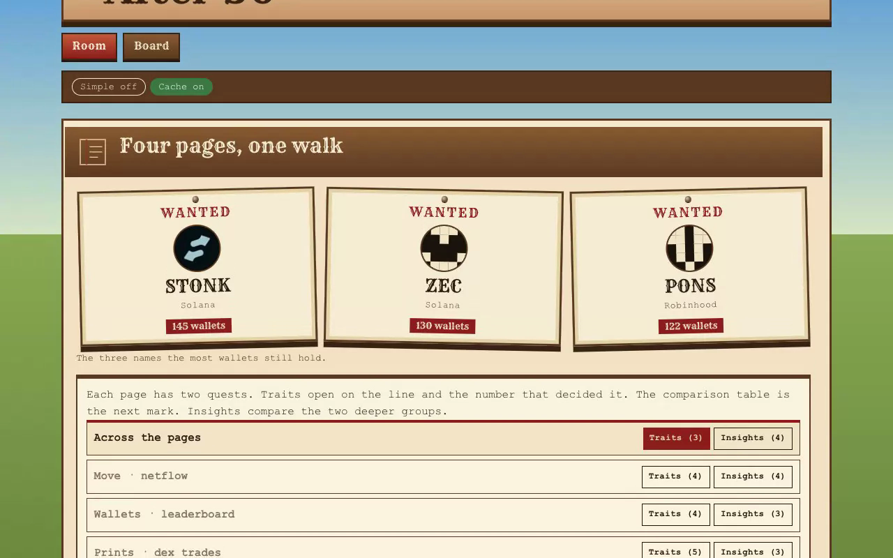

# After 50

Four smart-money lists. Each list is split into two groups.

Traits set the top of a list next to the rest of that same page. Insights set two deeper groups next to each other. Both quests open on a comparison table, then the lines. A figure the payload does not contain is not shown. None of these seats is an order.

## Sites

Two public copies of this app.

- [https://after-50.onrender.com](https://after-50.onrender.com/) runs the Next server. Simple and Cache are both on the bar. The four posts go to the API. The free instance sleeps, then takes about a minute to wake.
- [https://after-50.surge.sh](https://after-50.surge.sh/) is the static copy. It reads the saved pages. Simple is on the bar. Cache is not, because there is no server.

## Video



<video src="recording/room-and-board.webm" controls width="576" height="360"></video>

## Run it

You need Node 22 and npm. From this folder:

```bash
npm install
```

Create `.env.local` here with one line, `NANSEN_API_KEY=`, and your own key. `.env*` is gitignored.

```bash
npm run dev -- --port 43127 --hostname 127.0.0.1
```

Open [http://127.0.0.1:43127](http://127.0.0.1:43127).

`npm test` checks the rules and does not call Nansen.

## Room

The room is one walk. It posts four routes when it opens: netflow, the profit leaderboard, dex trades, and holdings. Each costs 5 credits. A body already cached costs nothing.

Each page has two quests. Pick Traits or Insights. Mark read moves to the next line. Simple, in the top bar, switches every line between the field sentence and a short reading. It does not reload. Cache, next to it, keeps the disk cache on or off and reloads.

The four source desks stay in the code and stay off this screen while `SHOW_SOURCE_DESKS` in `lib/constants.ts` is false. The walk still calls their routes.

### Traits

- **Move.** The largest 24h moves against the quieter names on the same netflow page. The rank is the size of the move.
- **Wallets.** The 50 Solana wallets with the most 30-day profit against the other wallets on that list. Profit is only the cut.
- **Prints.** Buys on the Solana tape. Age and size are at the buy, for the profit-list wallets against the other wallets that printed.
- **Holds.** The names the most wallets still hold, on every chain in the call, against the thinner names on that page. Holder count only orders the list.
- **Across.** A name that shows up on one page and is missing from another. This quest is the lines. It has no comparison table of its own.

A zero, or a missing window, is not a sign flip. A null median is absent. Page 2 is not fetched. If the page is not the last page, the rest of the book is not here.

### Insights

Each insight table uses the same two columns as traits. The groups are different.

- **Move.** A coin 3 days old or younger whose 24h, 7d, and 30d flow match, next to a large coin with a green day and a 30d outflow more than five times that size.
- **Holds.** A thin seat that is not on the busiest chain. The same ticker on two chains. An address that appears on more than one chain. Three names that are most of the page.
- **On the move, off the book.** At least 9 flow traders and at most 8 holders on the same chain and address, next to a name with positive 24h flow and a holdings balance down at least 15%.

The same ticker on two chains is two coins. An address is only the same asset when the chain matches. The flow page is sorted by positive 24h, so it cannot show who left.

## The four calls

| Page | Route | Nansen | Body |
| --- | --- | --- | --- |
| Move | `POST /api/netflow` | `POST /api/v1/smart-money/netflow` | all chains, page 1, 100 rows, 24h descending |
| Wallets | `POST /api/leaderboard` | `POST /api/v1/smart-money/pnl-leaderboard` | Solana, 30 days, page 1, 1000 rows, total PnL descending |
| Prints | `POST /api/dex-trades` | `POST /api/v1/smart-money/dex-trades` | Solana, trailing 24h, page 1, 1000 prints, newest first |
| Holds | `POST /api/holdings` | `POST /api/v1/smart-money/holdings` | all chains, page 1, 1000 rows, holder count descending |

Leaderboard comparisons that need another endpoint are not requested. A top-50 wallet with no buy on the tape is left out of the print comparison. Holdings and netflow join on chain plus address.

## Board

`/board` checks up to five symbols or addresses against the pages already loaded. The read is traits for those names. A name that is not on the page says so. No second call when the cache already has the body.

## Credits

A successful body is cached in memory for two minutes, and on disk in `data/nansen` while Cache is on. Those files are the saved pages. A later run with Cache on reads them and does not call Nansen again. The top line is credits spent in this server process, account remaining when Nansen sends it, and whether this view came from cache. A refusal does not repeat the previous charge. If the account cannot cover a call, the page shows Nansen's error.

The response JSON is behind **Response**, collapsed.

The pages do not call who-bought-sold, profiler labels, `agent/fast`, flow intelligence, a token PnL leaderboard, a perp leaderboard, or chain rank. They do not fetch page 2.

`GET /api/session` is the credit counter.

## Todo

- [ ] Match this file to the walk. Traits open on the line and the number. The comparison table is the next mark. The first section is On the move, off the book, and it has a table. Then Move, Wallets, Prints, Holds, and Cap then, cap now. Drop the line that says both quests open on a table, and the line that says Across has no table.
- [ ] Drop "trailing 24 hours" and "last 24 hours" from the prints claim, or print the span the rows actually cover. `DEX_TRADES_BODY` in `lib/constants.ts` asks for the newest 1000 prints and has no from or to. The phrase is also in the prints frame in `lib/rules.ts`, the lede in `app/page.tsx`, `lib/plain.ts`, and the dex row in the table above. The test in `lib/rules.test.ts` locks the frame sentence.
- [ ] Check in a short recording of a cache-off run. Four calls. The first stamp, the count, and one named mint. Point this file at that recording.
